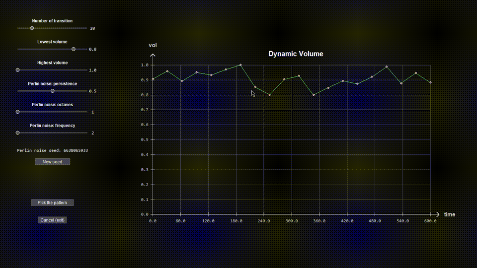

## Multilayered-Noise-Generator
This program generates multilayered deep audio noise using the FFmpeg audio source "anoisesrc" to generate the noise. It can create brown noise, white noise, and other types of noise that are known to help some people relax and promote a focused ambiance.

## Installation
1. Download this repository and save it to your machine (e.g. ~/myproject/multilayered_noise_generator).
2. Install dependencies:
    - [carbon](https://github.com/nvfp/carbon)
    - NumPy:
        ```sh
        pip install -r requirements.txt
        ```
    - [FFmpeg](https://ffmpeg.org/download.html)
3. All set and ready to use!

## Usage
### Try running the following:
```sh
python multilayered_noise_generator
```
This will generate seven layers of 60 seconds brown noise that cutoff within the range of 20 to 432 Hz.

### You can also run:
```sh
python multilayered_noise_generator -d 3600 -c white -n 15 -lp 300
```
This command will generate one hour of deep white noise that may help promote relaxation, improve concentration, and aid in sleep.

### Using dynamic volume:
```sh
python multilayered_noise_generator -d 600 -c velvet -n 3 -dv
```
This command launches the GUI for setting the noise pattern that dynamically adjusts the volume, creating a captivating ambience.


### Here are the available command line options for customizing the generated noise:
* `-d`: Track length in seconds (default: 60)
* `-c`: Noise color options: white, pink, brown, blue, violet, and velvet (default: brown)
* `-n`: Number of layers (default: 7)
* `-hp`: Highpass frequency value (default: 20 Hz)
* `-lp`: Lowpass frequency value (default: 432 Hz)
* `-vol`: Number of volume folds (default: number of layers)
* `-dv`: Open GUI to set dynamic volume using Perlin noise
* `-ff`: FFmpeg binary file path or command (default: 'ffmpeg')
* `-o`: Output folder path (default: multilayered_noise_generator/output)

## Learn more
To learn about the FFmpeg aspect, visit this [webpage](https://nvfp.github.io/misc/ffmpeg/index.html#multilayered_noise_generator) for more information.

## Troubleshooting
#### If you encounter the error message "multilayered_noise_generator: error: ffmpeg not found or not a recognized command (ffmpeg)", consider the following:
- Ensure that FFmpeg is installed on your machine and is accessible as a command in the shell.
- If FFmpeg is installed but not accessible, add its location to your system's PATH variable.
- Alternatively, you can reference the FFmpeg binary using the `-ff` flag when running a command. For example:

    ```sh
    python multilayered_noise_generator -ff ~/ffmpeg/bin/ffmpeg.exe
    ```
By trying these solutions, you should be able to resolve the problem.

## Changelog
- 1.1.0 (May 6, 2023):
    - added volume-randomizer using Perlin noise
    - changed the output filename format

## License
This project is licensed under the MIT license.
